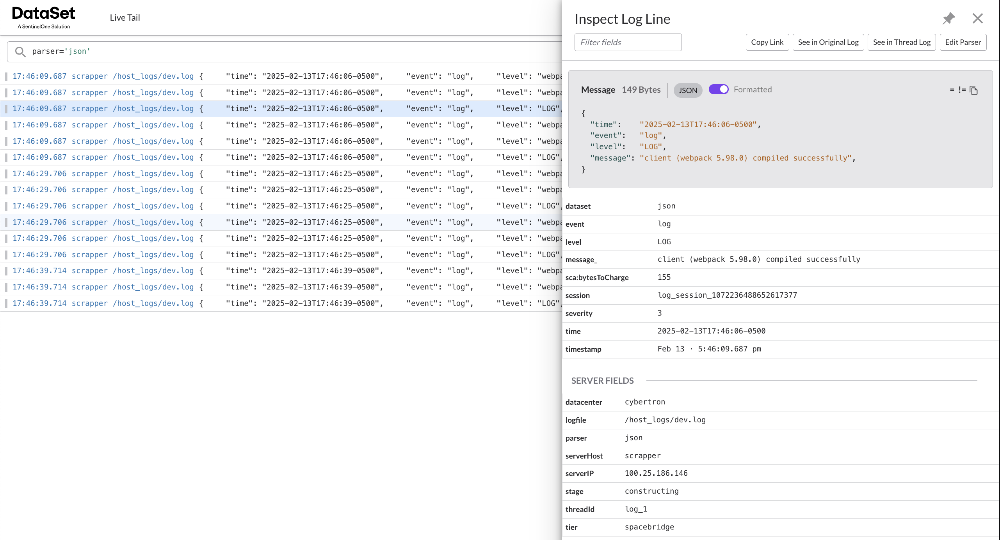

[](https://github.com/scalyr/scalyr-agent-2)

# scalyr-mac-docker-json

Are you developing on a Mac (Intel **or** Apple Silicon) and need to ship logs to Scalyr (SentinelOne)? Tired of hearing there’s “no official macOS agent?” This project solves that pain by running the **Scalyr Docker JSON agent** in a container on **any** modern Mac environment. Collect your Mac **host logs** with minimal setup, no fuss—and if you decide to also ship Docker container logs, this setup is easy to adapt.



## Pain & Motivation

> **“We have logs on our Mac dev machines, but Scalyr doesn’t officially support a native macOS agent. We need to unify logs across all environments.”**

Sound familiar? Many teams rely on consistent logs for real-time troubleshooting, but hit a wall when devs work on macOS. This can hamper your **time-to-detect** critical issues, lead to data blind spots, and create operational friction. The **scalyr-mac-docker-json** workaround resolves this gap so you can move forward, accelerate adoption, and focus on valuable problem-solving—rather than wrestling with log ingestion.

## How This Solution Helps (Value)

- **Universal Mac Support**: Works on **Intel** **and** **Apple Silicon** (via Docker `platform` if needed).
- **Host Log Collection**: Ships `.log` files from your macOS host directly to Scalyr.
- **Easy to Extend**: Want to also send Docker logs? Mount the Docker socket and remove or modify the override snippet—et voilà.
- **No Extra Agents**: Everything runs in a lightweight container, using the official Scalyr Docker JSON image (not the syslog variant).
- **Configurable**: Tweak `.env` for environment-specific paths and keys. Adjust `docker.json` to define custom attributes, hostnames, or advanced settings.

## Quick Start

1. **Clone this repo** (or copy the [docker-compose.yml](docker-compose.yml) and [docker.json](docker.json)).
2. **Create / edit your `.env`:**
   ```bash
   SCALYR_API_KEY=your-scalyr-key-here
   HOST_LOG_DIR=/path/to/your/mac/logs
   ```
3. **Run**:
   ```bash
   docker compose up -d
   ```
4. Check your **Scalyr / SentinelOne** account: You’ll see logs from `HOST_LOG_DIR` on your Mac, now ingested as JSON.

## Files & Structure

```
.
├── .env
├── README.md
├── docker-compose.yml
└── docker.json
```

- **`.env`**: Stores your Scalyr API key and the path to the host logs.
- **`docker-compose.yml`**: Defines the Scalyr Agent container. Mounts your host logs into `/host_logs`, overwrites default Docker monitor configs, and references environment variables from `.env`.
- **`docker.json`**: The override snippet that configures your server attributes and host log collection. By default, it sets custom attributes (tier, stage, datacenter) and collects `*.log` files under `/host_logs`.

## How to Enable Docker Container Logs (Optional)

If you’d like to also collect logs from Docker containers on your Mac:

1. Remove or alter the `docker.json` snippet to include the Docker monitor.
2. Mount your Docker socket:
   ```yaml
   volumes:
     - /var/run/docker.sock:/var/scalyr/docker.sock:ro
     - /var/lib/docker/containers:/var/lib/docker/containers
   ```
3. Restart the container. Now the agent ships both Mac host logs and Docker container logs.

_For deeper reference on the Docker JSON approach, see the official [Scalyr Docker instructions](https://github.com/scalyr/scalyr-agent-2)._

## Why Use the JSON Image (vs. Syslog)?

- **`scalyr-agent-docker-json`** – Leverages Docker’s JSON file logging, typically simpler for modern DevOps.
- **`scalyr-agent-docker-syslog`** – Uses syslog for routing container logs (older method).

If your main goal is quick, hassle-free integration on macOS, the **JSON** driver is generally recommended.

## Upcoming Features

We're continually evolving the **scalyr-mac-docker-json** project to provide even more valuable insights and capabilities. Upcoming improvements include:

- **Enhanced Log Parsing**: Implementing parsing logic to automatically derive proper node logging levels (e.g., `info`, `error`, etc.) from the logs.
- **Expanded JSON Structure**: Adding additional fields to the JSON structure to ensure logs appear with enriched metadata under SDL's XDR view.
- **Improved Customization**: Allowing further customization of log attributes for deeper integration with your monitoring and alerting workflows.

Stay tuned for updates and enhancements that aim to make your log management even more seamless!

---

## License & Disclaimer

This project is licensed under the terms of the MIT License:

- See the [LICENSE](https://github.com/sva-s1/structured-logger/blob/main/LICENSE) file for the full license text.

**Trademarks:**

- “SentinelOne (S1),” “Scalyr,” and “Dataset” are registered trademarks of their respective owners. This project is **not** affiliated with nor endorsed by those entities in any way.

<br>

---

<br>

© 2025 An IT Guru  
All rights reserved.
